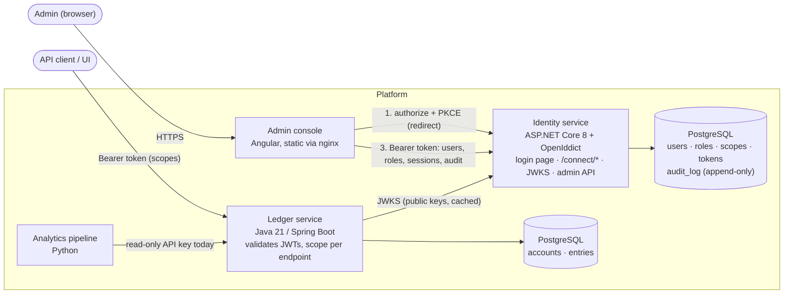

# Identity Service

[](https://github.com/debsamanta5571-dot/identity-service/actions/workflows/ci.yml)
[](https://github.com/debsamanta5571-dot/identity-service/actions/workflows/security.yml)

The identity and access service for a small platform of three services: an **OAuth2 / OpenID Connect server** with
users, roles, scoped tokens, TOTP multi-factor, an append-only audit log and an admin console. It secures the Java
**ledger** (double-entry accounting, [ledger-service](https://github.com/debsamanta5571-dot/ledger-service)) and the Python **analytics pipeline** that consumes its events.

**C# / ASP.NET Core 8 · EF Core · PostgreSQL · OpenIddict · Angular · Docker · GitHub Actions · Azure Container Apps**

- Authorization code flow with **PKCE (S256 only)**, OIDC discovery, **JWKS**, **RS256** tokens, **key rotation** with overlap.
- **Refresh token rotation with reuse detection**: replaying an old refresh token revokes the whole session and records a
  security event. 10-minute access tokens, revocation endpoint (RFC 7009).
- Users, roles and **granular scopes** (`transfers:write` is separate from `accounts:read`).
- **TOTP MFA** (RFC 6238): QR enrolment, replay-proof verification, single-use recovery codes, secrets encrypted at rest.
- **Argon2id** passwords, **lockout with exponential backoff**, per-IP and per-account **rate limiting**.
- **Append-only audit log** enforced by the database, with a filterable, paginated query endpoint.
- **RFC 7807** errors, security headers, strict CORS. No secrets in the repo; see [key management](docs/key-management.md).
- The ledger validates these tokens **itself** through JWKS and enforces one scope per endpoint.

## Architecture



### Sign-in and token validation

```mermaid
sequenceDiagram
    participant B as Browser (SPA)
    participant I as Identity service
    participant L as Ledger

    B->>B: verifier = random, challenge = SHA-256(verifier)
    B->>I: GET /connect/authorize (client_id, redirect_uri, scope, challenge, S256)
    I-->>B: 302 /account/login (no session yet)
    B->>I: POST /account/login (email, password, TOTP code if enabled)
    Note over I: Argon2id verify, lockout + rate limit checks, audit log
    I-->>B: 302 /connect/authorize with session cookie, then 302 redirect_uri?code=...
    B->>I: POST /connect/token (code, verifier)
    Note over I: PKCE check, roles → scopes, refresh family created
    I-->>B: access token (RS256, 10 min, scope claim) + refresh token
    B->>L: GET /accounts, Authorization: Bearer ...
    L->>I: GET /.well-known/jwks (first use, then cached; unknown kid refetches)
    Note over L: signature RS256 only, typ at+jwt, iss, aud, exp, then scope for this endpoint
    L-->>B: 200, or 403 if the scope is missing
```

## What I built and what I deliberately did not

The rule: **no hand-rolled crypto and no hand-rolled OAuth2 protocol layer**. Those are the places where "it works" and
"it is secure" diverge silently, and mature libraries exist. Everything that is *policy* is mine.

| Delegated to a library | Library |
| --- | --- |
| OAuth2/OIDC protocol: parsing and validating requests, PKCE verification, authorization codes, token endpoint, revocation endpoint, discovery, JWKS, redirect-URI matching | **OpenIddict** |
| JWT signing and verification (RS256), JWE for refresh tokens | OpenIddict + Microsoft.IdentityModel |
| Password KDF (Argon2id) | Konscious.Security.Cryptography.Argon2 |
| Random bytes, HMAC-SHA1, SHA-256, AES-256-GCM, RSA, constant-time comparison, X.509 | .NET platform crypto (`System.Security.Cryptography`) |
| QR code image | QRCoder |
| JWT/JWKS validation in the ledger | Spring Security resource server (Nimbus) |
| Browser-side SHA-256 and randomness for PKCE | WebCrypto |

| Built by me, on purpose | Where |
| --- | --- |
| Users, roles, scopes and how a user's scopes are computed (union of role scopes, intersected with what the client asked for, recomputed on every refresh) | `Security/OAuthPrincipal.cs`, `Data/` |
| Login, the login page, session cookie, open-redirect and CSRF protection | `Endpoints/AccountEndpoints.cs` |
| **Refresh-token reuse detection and family revocation** (OpenIddict stores and rotates tokens; deciding that reuse means theft is policy) | `Security/RefreshReuseDetector.cs` |
| Lockout with exponential backoff, race-safe under parallel guessing (optimistic concurrency on `xmin`) | `Security/AuthService.cs` |
| Per-IP and per-account rate limiting (built-in ASP.NET Core limiter plus a per-account partition) | `Program.cs`, `Security/AccountRateLimiter.cs` |
| TOTP itself: RFC 6238 on top of HMAC, drift window, single-use steps, atomic consumption | `Security/Totp.cs`, `Security/MfaService.cs` |
| Recovery codes, encryption of TOTP secrets at rest | `Security/MfaService.cs`, `Security/SecretProtector.cs` |
| Append-only audit log: schema, DB triggers, service, query endpoint | `Security/AuditService.cs`, migration `AuditLog`, `Endpoints/AuditEndpoints.cs` |
| Session listing and revocation, user status, admin API and console | `Endpoints/`, `admin-console/` |
| Scope enforcement per endpoint (identity API and ledger) | `Security/ScopeAuthorization.cs`, ledger `SecurityConfig` |
| The browser-side PKCE client (about 100 lines, see limitations) | `admin-console/src/app/core/auth.service.ts` |

## Run it

**Prerequisites:** Docker (for compose and for the Testcontainers tests), .NET 8 SDK, Node 22 for the console. The ledger repo is
expected next to this one (`../ledger-service`).

```bash
./scripts/dev-secrets.sh          # writes .env: random passwords, a fresh signing certificate, fresh keys
docker compose up --build
```

| | URL |
| --- | --- |
| Admin console | <http://localhost:4200> (sign in with the admin email/password printed by `dev-secrets.sh`) |
| OIDC discovery | <http://localhost:5001/.well-known/openid-configuration> |
| Ledger | <http://localhost:8080> |
| Analytics pipeline | `docker compose --profile analytics up` (needs `../analytics-pipeline` or `ANALYTICS_CONTEXT`) |

Compose runs everything over plain HTTP on localhost (`Server__RequireHttps=false`). Real deployments terminate TLS at the ingress.

### As a Windows executable

The identity service can also run as a single self-contained `.exe` (no .NET install needed):

```powershell
./scripts/dev-secrets.sh                 # once: creates .env (Git Bash)
./scripts/run-windows.ps1                # publishes dist\windows\Identity.Api.exe if missing, starts PostgreSQL in Docker, runs it
docker compose up -d --no-deps --build admin-console    # the console is a website, so it stays in a container
```

The exe listens on <http://localhost:5001>. It still needs PostgreSQL (the script starts one in Docker) and its secrets, which the script
reads from `.env`. `-Rebuild` republishes the exe. `dist/` is git-ignored.
### From source

```bash
docker run -d --name identity-pg -p 5432:5432 -e POSTGRES_USER=identity -e POSTGRES_PASSWORD=dev-only-pw -e POSTGRES_DB=identity postgres:16-alpine
cd src/Identity.Api
dotnet user-secrets set "ConnectionStrings:Identity" "Host=localhost;Database=identity;Username=identity;Password=dev-only-pw"
dotnet user-secrets set "Mfa:EncryptionKey" "$(openssl rand -base64 32)"
dotnet user-secrets set "Bootstrap:AdminEmail" "admin@example.com"
dotnet user-secrets set "Bootstrap:AdminPassword" "a-long-dev-passphrase"
dotnet dev-certs https --trust      # the cookie is Secure; the API listens on https://localhost:5001
dotnet run --launch-profile https

cd ../../admin-console && npm ci && npm start     # http://localhost:4200
```

In `Development` the signing key is ephemeral (tokens die on restart). Any other environment refuses to start without keys.

### Tests

```bash
dotnet test                                       # integration tests start PostgreSQL in Testcontainers (needs Docker)
TEST_PG_CONNECTION="Host=localhost;Username=postgres;Password=..." dotnet test    # or use an existing server
cd admin-console && npx ng test --watch=false --browsers=ChromeHeadless           # console unit tests
cd ../ledger-service && mvn verify                # ledger, including the JWT/scope tests
```

Some tests need no database and run anywhere: discovery, JWKS, key publication, CORS, headers, login page, password hashing,
TOTP against the RFC 6238 vectors, secret encryption. Coverage is collected in CI (`ci.yml`) and gated at 70% lines.

| Requirement | Test |
| --- | --- |
| Integration tests for every endpoint | `UserEndpointTests`, `RoleEndpointTests`, `LoginAndLockoutTests`, `OAuthTests`, `MfaTests`, `AuditTests`, `AdminApiTests` |
| Refresh token reuse revokes the family | `OAuthTests.Replaying_an_old_refresh_token_revokes_the_whole_family` |
| Lockout triggers after N failures and releases | `LoginAndLockoutTests.Locks_after_threshold…`, `Lock_releases_after_the_backoff…` |
| TOTP accepts a valid code, rejects a replay | `MfaTests.A_replayed_totp_code_is_rejected`, `TotpTests` |
| A token without the required scope is rejected by the ledger | ledger `JwtScopeIT.insufficientScopeTokenIsRejectedWith403` |

## API overview

| Endpoint | Purpose | Needs |
| --- | --- | --- |
| `GET /.well-known/openid-configuration`, `/.well-known/jwks` | Discovery, public signing keys | public |
| `GET /connect/authorize`, `POST /connect/token`, `POST /connect/revoke` | Authorization code + PKCE, refresh, revocation | client (public, PKCE) |
| `GET/POST /account/login`, `GET /account/logout` | Login page | public (rate limited) |
| `POST /api/mfa/enroll`, `/confirm`, `/disable` | Own second factor | any valid token |
| `GET/POST /api/users`, `GET /api/users/{id}`, `PUT /api/users/{id}/roles`, `PUT /api/users/{id}/status` | User administration | `users:admin` |
| `GET/POST /api/roles`, `GET /api/scopes` | Roles and scopes | `users:admin` |
| `GET /api/sessions`, `DELETE /api/sessions/{id}` | Active sessions | `users:admin` |
| `GET /api/audit` | Audit trail: `eventType` (`login.*`), `success`, `userId`, `actorId`, `ip`, `from`, `to`, `page`, `pageSize` | `audit:read` |
| `GET /health` | Liveness | public |

Seeded scopes: `accounts:read`, `accounts:write`, `transfers:read`, `transfers:write`, `audit:read`, `users:admin`.
Seeded roles: `admin` (all), `operator` (accounts and transfers), `auditor` (read-only plus audit).

## Security design

- **Passwords:** Argon2id (19 MiB, 2 iterations, 1 lane: the OWASP minimum, configurable), 16-byte random salt, stored as a PHC string with its
  own parameters so cost can be raised without invalidating hashes. 12 to 128 characters (length over composition rules; the cap bounds the work an attacker can force).
- **Login failures look identical** (unknown user, wrong password, inactive, locked, wrong MFA code), and a dummy hash is verified for unknown users so timing does not reveal accounts.
- **Lockout:** from the 5th consecutive failure the account locks for 30 s, doubling per further failure, capped at 1 h. Attempts during a lock are not counted (an attacker cannot extend someone's lock) and not evaluated. A wrong TOTP code counts as a failure, so a stolen password does not allow guessing 6-digit codes. Counter updates use optimistic concurrency, so parallel guesses cannot dodge it.
- **Rate limiting:** per IP (all login and MFA endpoints) and per normalised email (including nonexistent ones, so it leaks nothing). 429 with `Retry-After`.
- **Tokens:** authorization codes live 2 minutes and are single-use; access tokens 10 minutes; refresh tokens 7 days and rotate on every use. A reused refresh token (no leeway) revokes the authorization and every token under it. Roles are re-read at every refresh, so removing a role or deactivating a user takes effect within one access-token lifetime.
- **PKCE is mandatory and S256-only** (OpenIddict allows `plain` by default; that is switched off, and a test would catch a regression). Implicit, password and client-credentials grants are not enabled.
- **MFA:** 160-bit secrets, encrypted with AES-256-GCM (key in configuration, not in the database). A code is valid for its 30-second step plus one step of drift, and **each step can be accepted once**: consumption is a single `UPDATE ... WHERE last_step < @step`, so concurrent requests cannot both succeed. Recovery codes carry 80 random bits and are stored as SHA-256 hashes (fast hashing is safe for high-entropy values); using one is an atomic conditional update. Disabling MFA needs a valid code.
- **Audit log:** every login, failure, MFA event, token issue, revocation, refresh-reuse detection, role change, user and session action. Written in its own transaction. **Append-only in three layers:** no write endpoints, EF Core refuses to update or delete entries, and PostgreSQL triggers reject `UPDATE`, `DELETE` and `TRUNCATE` (in production the runtime role should also hold only `INSERT, SELECT` on the table). Entries never contain passwords, tokens or codes.
- **HTTP hardening:** RFC 7807 everywhere, `nosniff`, `frame-ancestors 'none'`, `no-store`, HSTS outside development, strict CORS (only the console origin, no credentials), antiforgery on the login form, return URLs restricted to local paths, logout redirects restricted to configured origins.

## Threat model

**Assets:** the signing key (it can mint any identity), user credentials and MFA secrets, refresh tokens, the audit log's integrity.
**Trust boundaries:** browser ↔ identity service; ledger ↔ identity service (public keys only); identity service ↔ database and secret store.
**Assumed:** TLS at the ingress; the secret store and CI are trustworthy; the database owner is more privileged than the app.

| Threat | Mitigation | Residual risk |
| --- | --- | --- |
| Credential stuffing / password guessing | Argon2id, lockout with backoff, per-IP and per-account limits, identical error responses | Per-account limits let an attacker slow a victim's logins (availability vs brute force); limits are per instance |
| User enumeration | Same response and equalised timing for unknown users | Account creation by admins returns 409 for duplicates (admin-only endpoint) |
| Stolen password | TOTP with replay protection, lockout on wrong codes | Real-time phishing of password + code; WebAuthn would close this |
| Authorization code interception | PKCE S256 mandatory, exact redirect URI match, 2-minute single-use codes | None known |
| Refresh token theft | Rotation, reuse detection revokes the family, tokens in browser memory only | Attacker who uses the token *first* wins until the victim's next refresh triggers detection |
| Token forgery | RS256, `alg` pinned by the ledger, `typ: at+jwt`, issuer and audience checked; private key only in Key Vault | Compromise of the signing key: rotate immediately (documented) |
| Stolen access token | 10-minute lifetime, audience-restricted | A leaked access token is usable until it expires; offline verification means revocation is not seen by the ledger |
| Privilege escalation | Scopes are the intersection of the request and the role, recomputed on refresh; the ledger denies unlisted endpoints | An admin can grant any role (audited); no approval workflow |
| Open redirect / CSRF on login | Local-only `returnUrl`, antiforgery token, allow-listed logout redirect, Lax cookie | None known |
| XSS in the console | Angular escaping, strict CSP via nginx, tokens not in storage, no inline scripts | A successful XSS can still call the API while the page is open |
| Audit log tampering | No write API, EF guard, DB triggers, minimal runtime privileges | A database owner can drop the triggers; ship the log to write-once storage for independence |
| Database leak | Argon2id hashes, encrypted TOTP secrets, hashed recovery codes, the token store keeps metadata (ids, status, expiry), not usable tokens | Encryption keys live in the same environment; separate Key Vault access mitigates |
| Secret leakage via repo/CI | Git-ignored `.env`/`*.pfx`, gitleaks on full history, OIDC to Azure, no stored credentials | Developer machines |
| Vulnerable dependencies | Dependabot, NuGet/npm audit and Trivy in CI, CodeQL | Zero-days |
| Analytics pipeline credentials | Read-only API key today | See below |

## Design trade-offs

- **OpenIddict over writing the protocol.** Weeks of subtle work I would get wrong, in exchange for adopting its opinions (its token store schema, its handler pipeline). I keep policy in explicit event handlers rather than forking behaviour.
- **Not ASP.NET Core Identity.** Its lockout, hashing and role tables would hide precisely what this project is meant to demonstrate, and its cookie-centric model adds surface I do not need. The cost is that I own the code and its tests.
- **Stateless access tokens, verified offline by the ledger.** Fast and no runtime coupling, but revocation is eventually consistent (10 minutes). Introspection would close the gap for a network call per request.
- **Scopes from roles, recomputed at every refresh.** Changes propagate within one token lifetime without a revocation storm; a role change does not affect already-issued access tokens.
- **Refresh reuse without leeway.** Strictest and simplest to reason about; a client that loses a refresh response (network failure after the server rotated) will be signed out. OpenIddict's optional leeway would allow a short retry window at the cost of a small theft window.
- **Rate limits in memory.** Correct on one instance and dependency-free; multiple replicas need Redis. Lockout, the important control, lives in the database and is correct at any scale.
- **Audit written in a separate transaction.** Events survive a rollback of the action, and a failed audit write fails the request rather than passing silently; the price is an extra round trip.
- **Certificates rather than raw RSA keys for signing.** OpenIddict's key selection rule (latest expiry signs) makes rotation a configuration change.
- **Hand-written browser PKCE client** instead of `oidc-client-ts`/`angular-oauth2-oidc`, to add no dependency beyond the agreed stack. It is small and tested, but for production I would use a maintained library or a backend-for-frontend.

## Known limitations and next steps

- **Service accounts.** The analytics pipeline is headless and cannot run an interactive flow. It uses the ledger's read-only API key today; the proper fix is the client-credentials grant with a dedicated client and only the scopes it needs. This is a scoping decision I left open.
- No password reset, email verification or user self-service beyond MFA. An admin sets initial passwords.
- No WebAuthn/passkeys; TOTP is phishable in real time.
- MFA encryption uses a single key without key ids, so rotating it needs a re-encryption pass (see key management).
- The console is intentionally plain and has no end-to-end browser tests.
- Sessions revoked in the console stop *new* tokens; existing access tokens work until they expire.
- Logout ends the login-page session and revokes the refresh token; there is no OIDC end-session endpoint.

## Repository layout

```
src/Identity.Api/       ASP.NET Core service (Endpoints, Security, Data + Migrations, Startup)
tests/Identity.Tests/   xUnit: unit, no-database and Testcontainers integration tests
admin-console/          Angular admin UI (+ Dockerfile, nginx template)
docs/                   key-management.md, deploy-azure.md, ledger-integration.diff (the ledger-side change)
scripts/dev-secrets.sh  generates a local .env
.github/workflows/      ci.yml (build, tests, coverage), security.yml (secrets, dependencies, images, CodeQL), deploy.yml
docker-compose.yml      identity + console + ledger (+ optional analytics)
```
