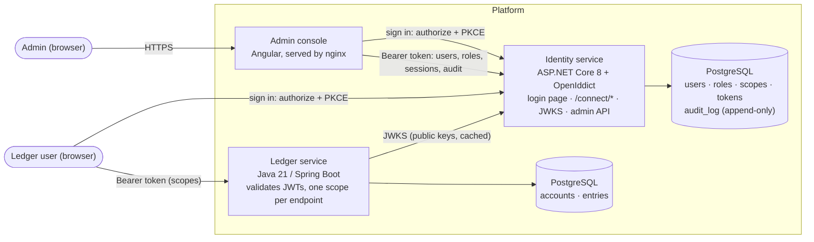
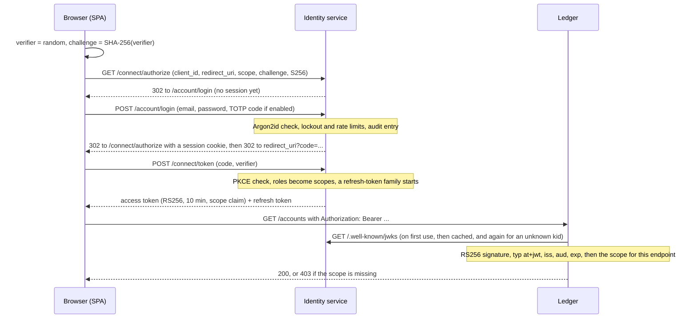

# Identity Service

[](https://github.com/debsamanta5571-dot/identity-service/actions/workflows/ci.yml)
[](https://github.com/debsamanta5571-dot/identity-service/actions/workflows/security.yml)

An OAuth 2.0 and OpenID Connect server that handles sign-in and access for a small platform. It manages users,
roles and scoped tokens, supports TOTP multi-factor authentication, keeps an append-only audit log, and comes with an
admin console. Its main client is the Java [ledger-service](https://github.com/debsamanta5571-dot/ledger-service),
a double-entry accounting API that checks these tokens itself.

C# · ASP.NET Core 8 · EF Core · PostgreSQL · OpenIddict · Angular · Docker · GitHub Actions · Azure Container Apps

What it covers:

- The authorization code flow with PKCE (S256 only), OIDC discovery, a JWKS endpoint, RS256-signed tokens, and
  signing-key rotation with an overlap period.
- Refresh-token rotation with reuse detection. Replaying an old refresh token revokes the whole session and records
  a security event. Access tokens last 10 minutes, and tokens can be revoked (RFC 7009).
- Users, roles and granular scopes, so `transfers:write` is separate from `accounts:read`.
- TOTP multi-factor authentication (RFC 6238) with QR enrollment, replay-proof verification, single-use recovery
  codes, and secrets encrypted at rest.
- Argon2id password hashing, account lockout with exponential backoff, and rate limiting per IP and per account.
- An audit log that the database itself keeps append-only, with a filterable, paginated query endpoint.
- RFC 7807 error responses, security headers and strict CORS. No secrets live in the repository; see
  [key management](docs/key-management.md).

## Requirements

| To... | You need |
| --- | --- |
| Run the platform (identity service, admin console and ledger) | [Docker Desktop](https://www.docker.com/products/docker-desktop/) (Windows, macOS or Linux) running, [Git](https://git-scm.com/), a web browser, the [ledger-service](https://github.com/debsamanta5571-dot/ledger-service) repository cloned next to this one (Compose builds it from `../ledger-service`), and ports 5001, 4200 and 8080 free |
| First run | Internet access (it downloads base images and packages) and about 4 GB of free disk space for the images and build cache. The first build takes a few minutes. |
| Generate the local secrets (`dev-secrets.sh`) | A Bash shell with `openssl`: built in on macOS and Linux; on Windows, Git Bash, which comes with Git |
| Build and run the tests | The .NET 8 SDK or newer, Node 22 and Google Chrome (for the console's tests), and Docker (the integration tests start PostgreSQL with Testcontainers). The ledger's tests also need JDK 21 and Maven. |
| Run the identity service as a Windows exe (optional) | Windows 10 or 11 (x64), PowerShell, and Docker for its PostgreSQL. The exe is not stored in the repository: `./scripts/run-windows.ps1` builds it on first use, which needs the .NET 8 SDK or newer. The built exe runs without .NET installed. |
| Use the desktop admin tool `IdentityAdmin.exe` (optional) | Windows 10 or 11 (x64), a web browser (you sign in there, not in the tool), the identity service already running, and port 53682 free. Like the exe above it is not in the repository; build it once with the .NET 8 SDK (see [Desktop admin tool](#desktop-admin-tool-create-accounts)). |

Check what you have (each command should print a version; only Docker, Git and OpenSSL are needed just to run it):

```bash
docker --version && docker info > /dev/null && echo "Docker is running"
git --version
openssl version        # used by scripts/dev-secrets.sh
dotnet --version       # 8.0 or newer; only to build or test
node --version         # 22; only to build or test the console
java -version          # 21; only for the ledger's tests
```

Quick start, from an empty folder:

```bash
git clone https://github.com/debsamanta5571-dot/identity-service
git clone https://github.com/debsamanta5571-dot/ledger-service
cd identity-service
./scripts/dev-secrets.sh      # once; on Windows, run this in Git Bash
docker compose up --build     # then open http://localhost:8080 and sign in as admin@example.com / ledger-demo-admin
```

## Architecture



### Signing in and validating a token



## What I built myself, and what I left to libraries

I did not write any cryptography or OAuth 2.0 protocol handling by hand. Those are the areas where "it works" and
"it is secure" can quietly diverge, and mature libraries exist for them. Everything that is policy, meaning who gets
which token and when, I wrote myself.

| Left to a library | Library |
| --- | --- |
| OAuth 2.0/OIDC protocol: parsing and validating requests, PKCE verification, authorization codes, the token and revocation endpoints, discovery, JWKS, redirect-URI matching | OpenIddict |
| JWT signing and verification (RS256), JWE for refresh tokens | OpenIddict and Microsoft.IdentityModel |
| Password hashing (Argon2id) | Konscious.Security.Cryptography.Argon2 |
| Random bytes, HMAC-SHA1, SHA-256, AES-256-GCM, RSA, constant-time comparison, X.509 | .NET platform cryptography (`System.Security.Cryptography`) |
| QR code images | QRCoder |
| JWT and JWKS validation in the ledger | Spring Security resource server (Nimbus) |
| Browser-side SHA-256 and randomness for PKCE | WebCrypto |

| Written by me | Where |
| --- | --- |
| Users, roles and scopes, and how a user's scopes are computed: the union of their roles' scopes, intersected with what the client asked for, and recomputed on every refresh | `Security/OAuthPrincipal.cs`, `Data/` |
| Sign-in, the login page, the session cookie, and open-redirect and CSRF protection | `Endpoints/AccountEndpoints.cs` |
| Refresh-token reuse detection and family revocation (OpenIddict stores and rotates tokens; treating reuse as theft is a policy decision) | `Security/RefreshReuseDetector.cs` |
| Lockout with exponential backoff, safe against parallel guessing (optimistic concurrency on `xmin`) | `Security/AuthService.cs` |
| Rate limiting per IP and per account (the built-in ASP.NET Core limiter plus a per-account partition) | `Program.cs`, `Security/AccountRateLimiter.cs` |
| TOTP itself: RFC 6238 on top of HMAC, a drift window, single-use time steps, atomic consumption | `Security/Totp.cs`, `Security/MfaService.cs` |
| Recovery codes, and encryption of TOTP secrets at rest | `Security/MfaService.cs`, `Security/SecretProtector.cs` |
| The append-only audit log: schema, database triggers, service and query endpoint | `Security/AuditService.cs`, migration `AuditLog`, `Endpoints/AuditEndpoints.cs` |
| Session listing and revocation, user status, the admin API and console | `Endpoints/`, `admin-console/` |
| Per-endpoint scope enforcement in this service and in the ledger | `Security/ScopeAuthorization.cs`, ledger `SecurityConfig` |
| The browser-side PKCE client (about 100 lines; see the limitations) | `admin-console/src/app/core/auth.service.ts` |

## Running it

See [Requirements](#requirements) for what to install first. Compose expects the ledger repository to sit next to
this one, at `../ledger-service`.

```bash
./scripts/dev-secrets.sh          # writes .env: random database passwords, a fresh signing certificate, fresh keys
docker compose up --build
```

**Demo login:** `admin@example.com` / `ledger-demo-admin`

A fresh setup creates this admin so anyone can sign in and try the platform. The password is public, which is only
safe because Compose publishes every port on `127.0.0.1`, so nothing is reachable from your network. For a private,
random password, run `./scripts/dev-secrets.sh --random-admin` instead. The admin is created on the first start
against an empty database, so changing `.env` later does not change an existing admin's password.

| | URL |
| --- | --- |
| Admin console | <http://localhost:4200> (sign in with the demo login above) |
| OIDC discovery | <http://localhost:5001/.well-known/openid-configuration> |
| Ledger | <http://localhost:8080> |

Compose runs everything over plain HTTP on localhost (`Server__RequireHttps=false`). Real deployments terminate TLS
at the ingress.

### As a Windows executable

The identity service can also run as a single, self-contained `.exe`, with no .NET installation needed:

```powershell
./scripts/dev-secrets.sh                 # once: creates .env (run it in Git Bash)
./scripts/run-windows.ps1                # publishes dist\windows\Identity.Api.exe if missing, starts PostgreSQL in Docker, runs it
docker compose up -d --no-deps --build admin-console    # the console is a website, so it stays in a container
```

The exe listens on <http://localhost:5001>. It still needs PostgreSQL (the script starts one in Docker) and its
secrets, which the script reads from `.env`. Pass `-Rebuild` to republish the exe; `dist/` is git-ignored.

### Desktop admin tool (create accounts)

`IdentityAdmin.exe` is a small Windows program for administrators. Sign in, then create accounts (email, display name, an
initial password with a **Generate** button, roles) and see, disable or re-enable existing accounts.

```powershell
dotnet publish admin-desktop -c Release -r win-x64 --self-contained true -p:PublishSingleFile=true -o dist/admin-tool
./dist/admin-tool/IdentityAdmin.exe                                  # server defaults to http://localhost:5001
./dist/admin-tool/IdentityAdmin.exe --server http://localhost:5002   # or point it at another instance
```

It never sees your password. **Sign in** opens your browser on the identity service's own login page (so MFA and lockout apply),
and the tool receives the result on a loopback address (`http://127.0.0.1:53682/callback`, RFC 8252) using the same
authorization code + PKCE flow as the web console. It is registered as the public client `admin-desktop`; the account you sign
in with needs the `users:admin` scope, which the `admin` role has. The port is fixed because OpenIddict matches redirect URIs
exactly. Its project is outside `Identity.sln` on purpose (Windows-only; CI builds the solution on Linux).
`IdentityAdmin.exe --selftest <server>` runs the whole path headlessly (used to verify it: sign-in, create, list, disable, enable, and rejection of duplicates and weak passwords).

### From source

```bash
docker run -d --name identity-pg -p 5432:5432 -e POSTGRES_USER=identity -e POSTGRES_PASSWORD=dev-only-pw -e POSTGRES_DB=identity postgres:16-alpine
cd src/Identity.Api
dotnet user-secrets set "ConnectionStrings:Identity" "Host=localhost;Database=identity;Username=identity;Password=dev-only-pw"
dotnet user-secrets set "Mfa:EncryptionKey" "$(openssl rand -base64 32)"
dotnet user-secrets set "Bootstrap:AdminEmail" "admin@example.com"
dotnet user-secrets set "Bootstrap:AdminPassword" "a-long-dev-passphrase"
dotnet dev-certs https --trust      # the cookie is Secure, and the API listens on https://localhost:5001
dotnet run --launch-profile https

cd ../../admin-console && npm ci && npm start     # http://localhost:4200
```

In `Development` the signing key is ephemeral, so tokens stop working after a restart. Any other environment refuses
to start without keys.

### Tests

```bash
dotnet test                                       # integration tests start PostgreSQL in Testcontainers (needs Docker)
TEST_PG_CONNECTION="Host=localhost;Username=postgres;Password=..." dotnet test    # or use an existing server
cd admin-console && npx ng test --watch=false --browsers=ChromeHeadless           # console unit tests
cd ../ledger-service && mvn verify                # the ledger, including its JWT and scope tests
```

Some tests need no database and run anywhere: discovery, JWKS, key publication, CORS, headers, the login page,
password hashing, TOTP against the RFC 6238 test vectors, and secret encryption. CI collects coverage (`ci.yml`) and
requires at least 70% line coverage.

| Requirement | Test |
| --- | --- |
| Integration tests for every endpoint | `UserEndpointTests`, `RoleEndpointTests`, `LoginAndLockoutTests`, `OAuthTests`, `MfaTests`, `AuditTests`, `AdminApiTests` |
| Reusing a refresh token revokes its family | `OAuthTests.Replaying_an_old_refresh_token_revokes_the_whole_family` |
| Lockout starts after N failures and releases later | `LoginAndLockoutTests.Locks_after_threshold…`, `Lock_releases_after_the_backoff…` |
| TOTP accepts a valid code and rejects a replay | `MfaTests.A_replayed_totp_code_is_rejected`, `TotpTests` |
| The ledger rejects a token without the required scope | ledger `JwtScopeIT.insufficientScopeTokenIsRejectedWith403` |

## API overview

| Endpoint | Purpose | Needs |
| --- | --- | --- |
| `GET /.well-known/openid-configuration`, `/.well-known/jwks` | Discovery and public signing keys | nothing (public) |
| `GET /connect/authorize`, `POST /connect/token`, `POST /connect/revoke` | Authorization code + PKCE, refresh, revocation | a registered public client using PKCE |
| `GET/POST /account/login`, `GET /account/logout` | The login page | nothing (rate limited) |
| `POST /api/mfa/enroll`, `/confirm`, `/disable` | Managing your own second factor | any valid token |
| `GET/POST /api/users`, `GET /api/users/{id}`, `PUT /api/users/{id}/roles`, `PUT /api/users/{id}/status` | User administration | `users:admin` |
| `GET/POST /api/roles`, `GET /api/scopes` | Roles and scopes | `users:admin` |
| `GET /api/sessions`, `DELETE /api/sessions/{id}` | Active sessions | `users:admin` |
| `GET /api/audit` | The audit trail, filtered by `eventType` (such as `login.*`), `success`, `userId`, `actorId`, `ip`, `from`, `to`, `page` and `pageSize` | `audit:read` |
| `GET /health` | Liveness | nothing (public) |

Seeded scopes: `accounts:read`, `accounts:write`, `transfers:read`, `transfers:write`, `ledger:admin`, `audit:read`
and `users:admin`. Seeded roles: `admin` (every scope), `operator` (accounts and transfers) and `auditor` (read-only,
plus the audit log). Only `admin` receives `ledger:admin`, which lets the ledger's admins act on every account.

Registered clients: `admin-console`, and `ledger-ui` for the ledger's web page.

## Security design

- **Passwords.** Argon2id with 19 MiB of memory, 2 iterations and 1 lane (the OWASP minimum, and configurable), and
  a 16-byte random salt. Each hash is stored as a PHC string with its own parameters, so the cost can be raised
  without invalidating existing hashes. Passwords must be 12 to 128 characters: length matters more than
  composition rules, and the cap limits how much work an attacker can force.
- **Login failures look identical**, whether the user is unknown, the password is wrong, the account is inactive
  or locked, or the MFA code is wrong. For unknown users a dummy hash is still verified, so timing does not reveal
  which accounts exist.
- **Lockout.** From the 5th consecutive failure the account locks for 30 seconds, doubling with each further failure
  up to one hour. Attempts during a lock are neither counted nor evaluated, so an attacker cannot extend someone
  else's lock. A wrong TOTP code counts as a failure, so a stolen password does not allow guessing 6-digit codes.
  Counter updates use optimistic concurrency, so parallel guesses cannot slip past it.
- **Rate limiting** applies per IP (on all login and MFA endpoints) and per normalized email address, including
  addresses that do not exist, so it reveals nothing. Over the limit, the response is 429 with `Retry-After`.
- **Tokens.** Authorization codes last 2 minutes and work once. Access tokens last 10 minutes, and refresh tokens
  7 days, rotating on every use. Reusing a refresh token (with no grace period) revokes the authorization and every
  token issued under it. Roles are re-read at every refresh, so removing a role or deactivating a user takes effect
  within one access-token lifetime.
- **PKCE is mandatory and S256-only.** OpenIddict allows `plain` by default; that is switched off, and a test would
  catch a regression. The implicit, password and client-credentials grants are not enabled.
- **MFA.** Secrets are 160 bits, encrypted with AES-256-GCM using a key kept in configuration, not in the database.
  A code is valid for its 30-second step plus one step of drift, and each step can be accepted only once: using a
  code is a single `UPDATE ... WHERE last_step < @step`, so two concurrent requests cannot both succeed. Recovery
  codes carry 80 random bits and are stored as SHA-256 hashes (a fast hash is safe for high-entropy values); using
  one is an atomic conditional update. Turning MFA off requires a valid code.
- **Audit log.** It records every login and failure, MFA event, token issue, revocation, detected refresh reuse,
  role change, and user or session action, each written in its own transaction. It is append-only in three layers:
  there are no write endpoints, EF Core refuses to update or delete entries, and PostgreSQL triggers reject
  `UPDATE`, `DELETE` and `TRUNCATE`. (In production, the runtime database role should also hold only `INSERT` and
  `SELECT` on the table.) Entries never contain passwords, tokens or codes.
- **HTTP hardening.** RFC 7807 errors everywhere, `nosniff`, `frame-ancestors 'none'`, `no-store`, and HSTS outside
  development. CORS is strict: only the configured client origins (the console and the ledger's web page), with no
  credentials. The login form has antiforgery protection, return URLs are limited to local paths, and logout only
  redirects to configured origins.

## Threat model

- **Assets:** the signing key (it can mint any identity), user credentials and MFA secrets, refresh tokens, and the
  integrity of the audit log.
- **Trust boundaries:** browser ↔ identity service; ledger ↔ identity service (public keys only); identity service ↔
  database and secret store.
- **Assumptions:** TLS at the ingress; the secret store and CI are trustworthy; the database owner is more
  privileged than the application.

| Threat | Mitigation | Residual risk |
| --- | --- | --- |
| Credential stuffing and password guessing | Argon2id, lockout with backoff, per-IP and per-account limits, identical error responses | Per-account limits let an attacker slow down a victim's logins (availability traded for brute-force protection); limits are per instance |
| User enumeration | The same response and equalized timing for unknown users | Admin-only account creation returns 409 for a duplicate email |
| Stolen password | TOTP with replay protection, lockout on wrong codes | Real-time phishing of password and code; WebAuthn would close this |
| Authorization code interception | Mandatory PKCE (S256), exact redirect-URI matching, 2-minute single-use codes | None known |
| Refresh token theft | Rotation, reuse detection that revokes the family, tokens kept in browser memory only | An attacker who uses the token *first* wins until the victim's next refresh triggers detection |
| Token forgery | RS256, `alg` pinned by the ledger, `typ: at+jwt`, issuer and audience checked, private key kept only in Key Vault | Compromise of the signing key; rotate immediately (documented) |
| Stolen access token | 10-minute lifetime, restricted audience | A leaked access token works until it expires; the ledger verifies offline, so it does not see revocations |
| Privilege escalation | Scopes are the intersection of the request and the role, recomputed on refresh; the ledger denies unlisted endpoints | An admin can grant any role (audited), with no approval workflow |
| Open redirect or CSRF on login | Local-only `returnUrl`, antiforgery token, allow-listed logout redirects, Lax cookie | None known |
| XSS in the console | Angular escaping, a strict CSP via nginx, tokens not in storage, no inline scripts | A successful XSS can still call the API while the page is open |
| Audit log tampering | No write API, EF guard, database triggers, minimal runtime privileges | A database owner can drop the triggers; shipping the log to write-once storage would make it independent |
| Database leak | Argon2id hashes, encrypted TOTP secrets, hashed recovery codes; the token store keeps metadata (IDs, status, expiry), not usable tokens | The encryption keys live in the same environment; separate Key Vault access mitigates this |
| Secret leakage via the repository or CI | Git-ignored `.env` and `*.pfx`, gitleaks on the full history, OIDC to Azure with no stored credentials | Developer machines |
| Vulnerable dependencies | Dependabot, NuGet and npm audits, Trivy image scans in CI, CodeQL | Zero-days |

## Design trade-offs

- **OpenIddict instead of writing the protocol.** It saves weeks of subtle work I would likely get wrong, in
  exchange for adopting its opinions (its token-store schema and handler pipeline). I keep policy in explicit event
  handlers rather than forking its behavior.
- **No ASP.NET Core Identity.** Its lockout, hashing and role tables would hide exactly what this project sets out
  to show, and its cookie-centric model adds surface I do not need. The cost is that I own that code and its tests.
- **Stateless access tokens, verified offline by the ledger.** This is fast and avoids runtime coupling, but
  revocation takes up to 10 minutes to reach the ledger. Token introspection would close that gap, at the cost of a
  network call per request.
- **Scopes from roles, recomputed at every refresh.** Changes spread within one token lifetime without a storm of
  revocations; already-issued access tokens are not affected by a role change.
- **No grace period for refresh-token reuse.** This is the strictest option and the easiest to reason about. The
  cost is that a client that loses a refresh response (a network failure after the server rotated the token) gets
  signed out. OpenIddict's optional grace period would allow a short retry window, at the cost of a short theft
  window.
- **Rate limits in memory.** They are correct on one instance and need no extra dependency; several replicas would
  need Redis. Lockout, the control that matters most, lives in the database and is correct at any scale.
- **Audit entries in a separate transaction.** Events survive even when the action rolls back, and a failed audit
  write fails the request instead of passing silently. The price is an extra round trip.
- **Certificates rather than raw RSA keys for signing.** OpenIddict signs with the certificate that expires last,
  which turns key rotation into a configuration change.
- **A hand-written browser PKCE client** instead of `oidc-client-ts` or `angular-oauth2-oidc`, to avoid adding a
  dependency beyond the agreed stack. It is small and tested, but in production I would use a maintained library or
  a backend-for-frontend.

## Known limitations and next steps

- **Service accounts.** A headless client (a batch job or another service) cannot use an interactive sign-in flow,
  so today it would call the ledger with one of the ledger's own API keys. The proper fix is the client-credentials
  grant, with a dedicated client limited to the scopes it needs.
- There is no password reset, email verification or user self-service beyond MFA. An admin sets initial passwords.
- There is no WebAuthn or passkey support, and TOTP can be phished in real time.
- MFA encryption uses a single key without key IDs, so rotating it needs a re-encryption pass (see key management).
- The console is intentionally plain and has no end-to-end browser tests.
- Revoking a session in the console stops *new* tokens; existing access tokens keep working until they expire.
- Logout ends the login-page session and revokes the refresh token, but there is no OIDC end-session endpoint.

## Repository layout

```
src/Identity.Api/       the ASP.NET Core service (Endpoints, Security, Data and Migrations, Startup)
tests/Identity.Tests/   xUnit: unit, database-free and Testcontainers integration tests
admin-console/          the Angular admin UI (with its Dockerfile and nginx template)
docs/                   key-management.md, deploy-azure.md, ledger-integration.diff (the original ledger-side change)
scripts/                dev-secrets.sh (generates a local .env), run-windows.ps1 (runs the Windows executable)
.github/workflows/      ci.yml (build, tests, coverage), security.yml (secrets, dependencies, images, CodeQL), deploy.yml
docker-compose.yml      the identity service, console and ledger
```
